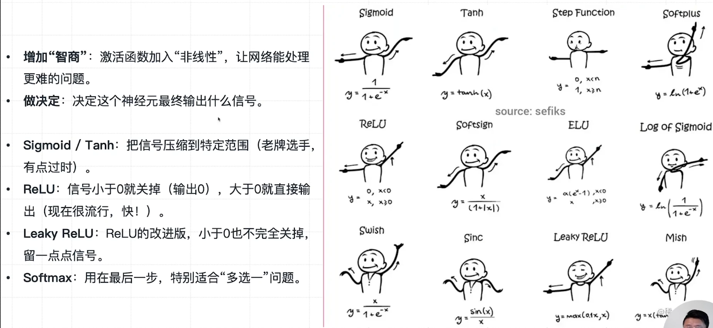
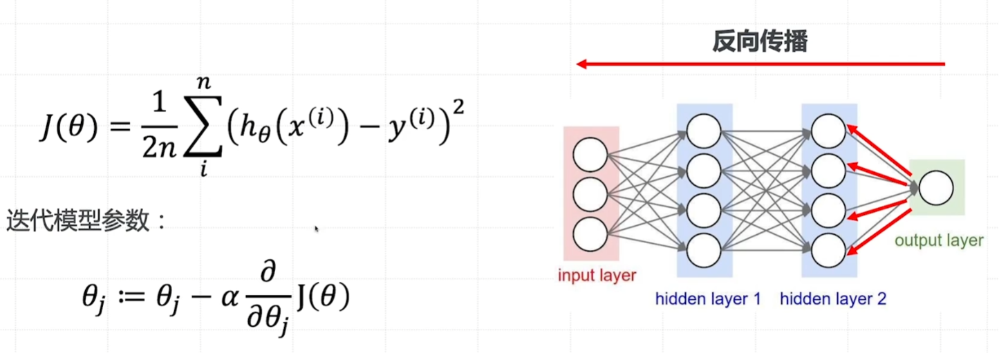
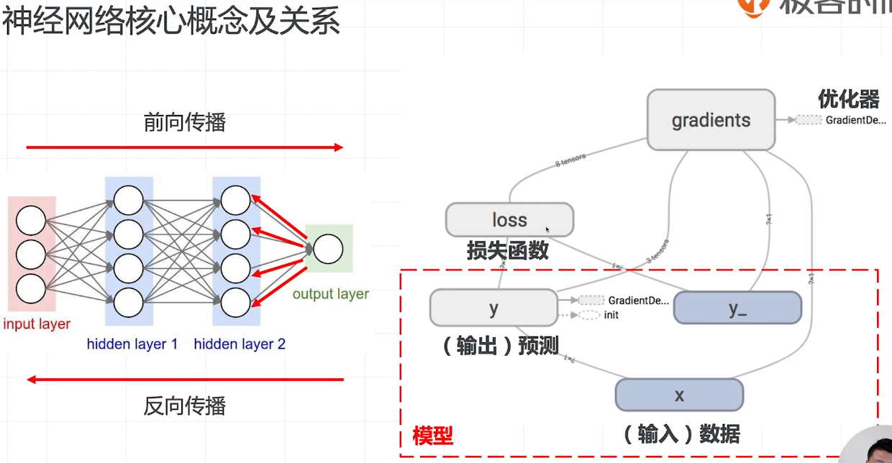
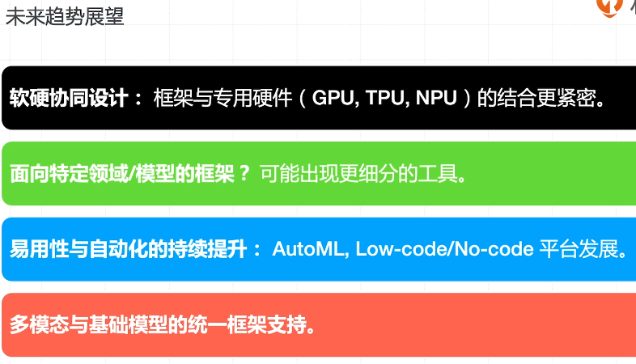

[toc]

## 第一章：机器学习与深度学习理论基础

数据的质量


非监督学习


K-means聚类（K-means Clustering）eg:客户分群


层次聚类（Hierarchical Clustering）
主成分分析（PCA) eg:图像压缩


自编码器（Autoencoders）
孤立森林（Isolation Forest)


半监督学习


自训练算法


### 神经网络中的基础概念

激活函数





前向传播


训练机制

反向传播



优化


随机梯度下降


高级优化器


核心概念及关系




ResNet


RNN


Seq2Seq




## 第二章：大模型发展全景与关键技术


NNLM

+ 神经网络（RNN/LSTM    天然支持序列模型）可用来做语言模型了
+ 把单词的语义作为一种词向量
+ 词向量在一堆语料中进行学习


两个问题：

1. 长距离依赖（梯度消失）
2. 计算效率（RNN难以并行）


### 注意力模型

注意力模型：捕捉长距离依赖


注意力机制：


> 在深度学习和自然语言处理中，**注意力机制（Attention Mechanism）**是一种强大的工具，用于使模型能够聚焦于输入数据的不同部分。其中，**Query（Q）、Key（K）和Value（V）**是注意力机制中的核心组件，通过计算Query与Key的相似度，并基于此对Value进行加权求和，模型能够灵活地聚焦于输入数据的不同部分。自注意力和多头注意力进一步扩展了这一机制的应用范围，使其在处理复杂任务时表现出色。
>
> Q、K、V的基本概念
>
> - **Query（查询，Q）**：表示模型想要关注的输入部分。可以理解为模型提出的问题或需要查找的信息。
> - **Key（键，K）**：表示输入数据中的各个部分。每个Key对应一个Value，用于与Query进行匹配。
> - **Value（值，V）**：表示与每个Key相关联的实际信息。通过Query与Key的匹配，模型可以决定哪些Value是最相关的，并据此进行加权求和。
>
> ## 注意力机制的工作原理
>
> 注意力机制的**核心在于计算Query与各个Key之间的相似度**，然后根**据相似度对相应的Value进行加权求和**，从而得到最终的输出。具体步骤如下：
>
> 1. **计算注意力分数（Attention Scores）**：
>    - 将Query与每个Key进行比较，通常通过点积（Dot Product）、缩放点积（Scaled Dot-Product）或其他相似度度量方法计算得分。
> 2. **归一化注意力分数**：
>    - 使用softmax函数将注意力分数归一化，使得所有分数之和为1，这样可以得到每个Key相对于Query的权重。
> 3. **加权求和**：
>    - 将每个Value与其对应的权重相乘，并将所有加权后的Value进行求和，得到最终的输出。
>
> ## 自注意力（Self-Attention）
>
> 在许多现代深度学习模型中，特别是在Transformer架构中，广泛应用的是**自注意力（Self-Attention）**机制。自注意力允许模型在同一输入序列内的不同位置之间建立联系，而无需依赖固定的顺序或位置编码。
>
> ### 自注意力的计算步骤
>
> 1. **线性变换**：
>    - 将输入序列通过三个不同的线性变换（通常是全连接层）分别得到Query（Q）、Key（K）和Value（V）矩阵。
> 2. **计算注意力分数**：
>    - 使用Q与K进行点积运算，得到注意力分数矩阵。
> 3. **缩放与归一化**：
>    - 为了防止点积结果过大，通常会对注意力分数进行缩放（如除以√d_k，其中d_k是Key向量的维度）。
>    - 然后应用softmax函数，得到每个位置的注意力权重。
> 4. **加权求和**：
>    - 将Value矩阵与注意力权重相乘，并进行求和，得到每个位置的输出。
>
> ### 公式表示
>
> 假设有一个输入序列 
> $$
> X = [x_1, x_2, ..., x_n] 
> $$
> 经过线性变换后得到：
> $$
> Q = XW_Q \\ K = XW_K \\ V = XW_V
> $$
> 其中，
> $$
> W_Q, W_K, W_V
> $$
> 是可学习的权重矩阵。
>
> 注意力分数计算：
>
> $$
> \text{Attention}(Q, K, V) = \text{softmax}\left(\frac{QK^T}{\sqrt{d_k}}\right)V
> $$
> 
>
> 
>
> ### 多头注意力（Multi-Head Attention）**并行计算不同子空间的特征**
>
> 为了捕捉输入序列中不同子空间的信息，Transformer引入了**多头注意力（Multi-Head Attention）**机制。多头注意力并行地执行多次自注意力计算，每次使用不同的线性变换，最后将各个头的输出拼接起来。
>
> ### 公式表示
>
> 假设有h个头，则：
>
> $$
> \text{MultiHead}(Q, K, V) = \text{Concat}(\text{head}_1, ..., \text{head}_h)W_O \\ \text{其中，head}_i = \text{Attention}(QW_i^Q, KW_i^K, VW_i^V)
> $$
>
> $$
> W_O
> $$
>
>  是输出变换的权重矩阵。


注意力机制的特点和优势

1. 注意力机制有助于克服循环神经网络（RNNs）的一些挑战，例如输
   入序列长度增加时性能下降和顺序处理输入导致的计算效率低下。
2. 在自然语言处理（NLP）、计算机视觉（ComputerVision）、跨模
   态任务和推荐系统等多个领域中，注意力机制已成为多项任务中的最
   先进模型，取得了显著的性能提升。
3. 注意力机制不仅可以提高主要任务的性能，还具有其他优势。它们被
   广泛用于提高神经网络的可解释性，帮助解释模型的决策过程，使得
   原本被认为是黑盒模型的神经网络变得更易解释。这对于人们对机器
   学习模型的公平性、可追溯性和透明度的关注具有重要意义。


#### 多头注意力：并行计算不同子空间的特征


**Transformer**


#### 位置编码

**为何需要位置信息？**


**固定位置编码**


**固定位置编码的特性与优势**

用非常低的计算量，把我们输入的单词的位置，代入到它的词向量中，并且不需要修改我们模型的整个架构，位置编码不需要去学习参数，计算量几乎没有增加


**相对位置编码**


**旋转位置编码**


## 第三章

### wsl2启动jupyter notebook

```bash
conda install -c conda-forge jupyterlab
```

打开配置文件`jupyter_notebook_config.py`。

```bash
jupyter lab --generate-config
```

添加

```bash
c.ServerApp.allow_root = True # 非 root 用户启动，无需修改
c.ServerApp.ip = '*'
c.NotebookApp.use_redirect_file = False
```

在`~/.bashrc` 文件末尾添加，指定默认浏览器地址，例如

```bash
export BROWSER='/mnt/c/Program Files/Google/Chrome/Application/chrome.exe'
```


```bash
source ~/.bashrc
```


```bash
jupyter notebook
```

